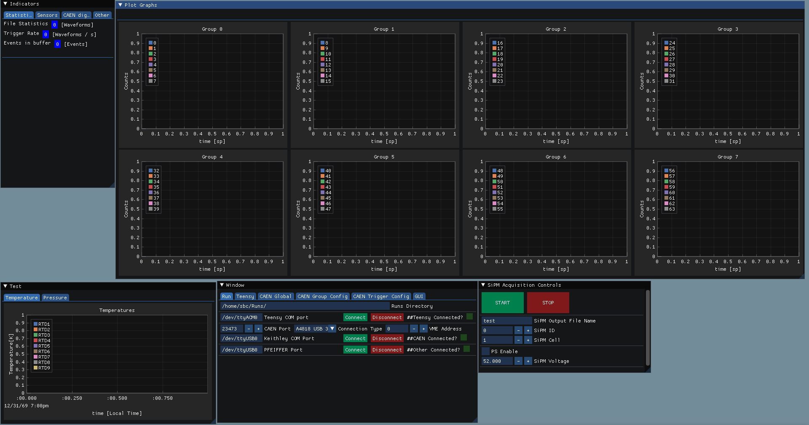

# Introduction
The purpose of this software is to interface the [CAEN](https://www.caen.it) 
libraries with a clean GUI and save the files in the SBC Binary format while 
minimizing dead time.

# Compiling Instructions
## All
- Have Git, CMake (3.11 or higher) and a C++20 compatible compiler.
- Install the CAEN libraries: [CAENVMElib](https://www.caen.it/products/caenvmelib-library/),
[CAENComm](https://www.caen.it/products/caencomm-library/) and
[CAENDigitizer](https://www.caen.it/products/caendigitizer-library/).
- (optional) VULKAN-SDK (if using the vulkan backend)
- Have [SiPMCharacterization](https://github.com/SBC-Collaboration/SiPMCharacterization)
in the same folder as this git.

## Windows
If compiling this for windows make sure you have downloaded and installed:

- [MSYS2](https://www.msys2.org/) (with build-essentials, clang-tools-extra PREFERRED). Click MSYS2 for more instructions.
- Git for windows

Then clone the repository

`git clone https://github.com/SBC-Collaboration/SBC-SIPM-Testing-Software`

In a Windows terminal, the compilation steps are:

1. `cd ${PROJECT_LOCATION}`
2. `cmake . -B build -G "MinGW Makefiles" -DCAEN_DIR=${CAEN_LOCATION} -DUSE_VULKAN=ON`
   If not using the Vulkan backend set USE_VULKAN to OFF.
3. `mingw32-make -j`

CAEN_LOCATION should be C:\CAEN or whenever it was installed.

## LINUX

Have a working C++ compiler with C++20 features, cmake, and git. Then clone the repository:

`git clone https://github.com/SBC-Collaboration/SBC-SIPM-Testing-Software`

The compilation steps are (Linux):
1. `cd ${PROJECT_LOCATION}`
2. `cmake . -B build -G "MinGW Makefiles" -DCAEN_DIR=${CAEN_LOCATION} -DUSE_VULKAN=ON`
   If not using the Vulkan backend set USE_VULKAN to OFF.
3. `make -j`

You will probably have some errors in the cmake running, most of them can be solved by googling the library that is required!

## MAC
Good luck.

## Note on CAEN Libraries
If the intention is to use this software to run the CAEN digitizer functionalities.
It is required to install CAEN libraries. For both linux and windows, this can be done by following the CAENVME, CAENComm and CAENDigitizer libraries installation instruction.

If they are installed in an unusual location, it is possible to add `-DCAEN_DIR=dir\to\CAEN` while running cmake.

# Developer instructions
If the intention is to develop the code:
1. Install [Sublime text](https://www.sublimetext.com/)
2. Install the package manager in Sublime text.
3. Then, follow [this](https://chromium.googlesource.com/chromium/src/+/refs/heads/main/docs/sublime_ide.md#Setup) link to install SublimeLinter, SublimeLinter-cpplint, and LSP.
4. Follow the Windows/Linux compiling instructions
5. WINDOWS ONLY: to make step 2 work and after installing MSYS2, it is required to install clang-tidy and clangd. For that, click [this](https://packages.msys2.org/package/mingw-w64-x86_64-clang-tools-extra) link.
6. During cmake add the option `-DCMAKE_EXPORT_COMPILE_COMMANDS=ON`
7. With all of this, Sublime Text should turn into a full IDE with code completion and error checking!

or
1. Get [Clion](https://www.jetbrains.com/clion/). It should be free as long as you are a student.

# Common Problems:

## ALL:
-- Nothing so far, but I bet they are there. Lurking in the shadows.

[//]: # (# Details about the binary save format &#40;SBC preferred data format&#41;)

[//]: # (Here is the fields and their corresponding dimensions of the binary data that are being saved. The data can be read by the DataHandling/ReadBinary.py script in the [SBC-Analysis]&#40;https://github.com/SBC-Collaboration/SBC-Analysis&#41; repository.)

[//]: # (First here are the dimension definitions:)

[//]: # (- n_triggers: number of triggers accepted by the digitizer)

[//]: # (- n_channels: number of channels enabled for acquisition)

[//]: # (- record_length: the number of samples digitized in a given trigger for a channel)

[//]: # ()
[//]: # (These are the fields of saved data and their corresponding dimensions. Fields with n_triggers* mean the value is constant for all triggers. Fields with n_channels* mean the value is common within a group.)

[//]: # (- sample_rate &#40;n_triggers*&#41;: ADC clock frequency for the digitizer. For DT5740D it is 62.5MHz. Actual triggering clock is at the same frequency as the sampling clock.)

[//]: # (- en_chs &#40;n_triggers*, n_channels&#41;: A list of the channels enabled for acquisition. This is the name of the channels for which the data are saved. Only channels in enabled groups will be saved.)

[//]: # (- trg_mask &#40;n_triggers*&#41;: This is a 32bit mask of all of the channels enabled for generating self-triggers. The least significant bit corresponds to channel 0, and so forth. If a bit is set to 1, then the channel participates in self-triggering. If 0, then it does not. Only channels in enabled groups are saved. It is possible that channels enabled for acquisition and for triggering are different.)

[//]: # (- thresholds &#40;n_triggers*, n_channels*&#41;: A 12-bit value representing the threshold for self-triggering. The unit is in LSB, where 1LSB = InputDynamicRange/2^12bit and the input dynamic range is 2V for DT5740D. The value is common within each group.)

[//]: # (- dc_offsets &#40;n_triggers*, n_channels*&#41;: A 16-bit value in 16-bit DAC LSB unit. The 0-64k range in DAC corresponds to the ADC range, as DAC is slightly larger than ADC. This value is common within a group.)

[//]: # (- dc_corrections &#40;n_triggers*, n_channels&#41;: A 8-bit correction to each channel in addition to the offset above. The value is in 12-bit LSB, which is roughly the same as the threshold. Since thresholds cannot be changed individually for each channel, change this setting to make sure each channel has the same trigger efficiency.)

[//]: # (- dc_range &#40;n_triggers*, n_channels*&#41;: Input dynamic range. Equals to 2V for DT5740D.)

[//]: # (- trg_source &#40;n_triggers&#41;: Indicates the trigger source causing the event acquisiton:)

[//]: # (	- Bit[10] = Software Trigger)

[//]: # (	- Bit[9] = External Trigger)

[//]: # (	- Bits[3:0] = Trigger requests from the groups.)

[//]: # (- time_stamp &#40;n_triggers&#41;: Time stamps for each trigger generated by the CAEN digitizer. This value is reset at start of acquisition, and increments every 1/2 ADC clock cycle &#40;125MHz for DT5740D&#41;. It is a 32bit number, with the lower 31 bits being the time counter, and the 32nd bit is the roll-over flag.)

[//]: # (- sipm_traces &#40;n_triggers, n_channels, record_length&#41;: Waveforms digitized at 62.5MHz. Each waveform has the same record length, and only data from channels enabled for acquisition are saved.)

# Credits
You do not need to install any of these dependencies directly, I just want to
have a space to thank all of these awesome people. Without them, this project
would not have been possible!

- [gl3w](https://github.com/skaslev/gl3w)
- [glfw](https://github.com/glfw/glfw)
- [imgui](https://github.com/ocornut/imgui)
- [implot](https://github.com/epezent/implot)
- [json](https://github.com/nlohmann/json)
- [serial](https://github.com/wjwwood/serial)
- [spdlog](https://github.com/gabime/spdlog)
- [readerwriterqueue](https://github.com/cameron314/readerwriterqueue)
- [concurrentqueue](https://github.com/cameron314/concurrentqueue)
- [tomlcplusplus](https://github.com/marzer/tomlplusplus)